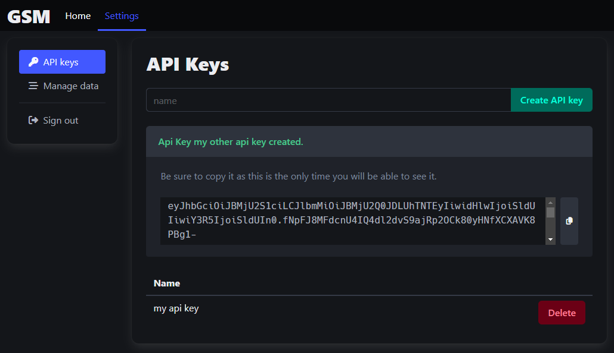

# Gabbro Secret Manager

A super simple secret manager for my home server deployment automation.

# Deployment

Can be deployed with docker

```bash
docker pull registry.gitlab.com/haondt/cicd/registry/gsm:latest
```

The following items must be configured:
- `JweSettings.EncryptionKey`: 32-byte encryption key for encrypting api tokens
- `JweSettings.SigningKey`: (optional, default can be used as well) 32-byte signing key for signing api tokens
- `GabbroSecretManagerPersistenceSettings.DatabasePath`: path to sqlite db

See [`docker-compose.yml`](./docker-compose.yml) for an example setup.

# Features

## User accounts

<div align="center">
    
</div>

## View, search and filter existing secrets

<div align="center">
    
</div>

## Edit / create new secrets

<div align="center">
    
</div>

## Create or delete api keys

<div align="center">
    
</div>

## Retrieve secrets via api

<div align="center">
    
</div>


Details:
- Api must be called with an api key as a bearer token

Endpoints:
- `GET` - `{server-url}/api/secrets` - returns all secrets
  - also supports query items
      - `name` - filter the name of the secret
      - `tags` - filter for secrets that contain all given tags
  - e.g. `{server-url}/api/secrets?name=Foo&tags=bar&tags=baz`
- `GET` - `{server-url}/api/secret/{SECRET_ID}` - returns a particular secret
- `GET` - `{server-url}/api/export-data` - gets all user data

## Manage data

<div align="center">
    
</div>